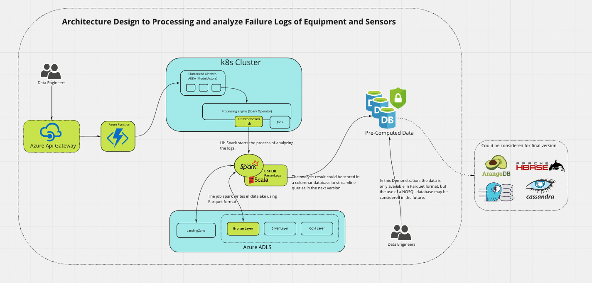

    

# Shape Test - Data Engineer


In this assignment, you will get to know the industry we work in – don’t worry, no previous experience is required. The assignment involves an FPSO (Floating Production, Storage, and Offloading) vessel data, and we need your help with equipment failure data ingestion. We hope this exercise will give you some insight into the challenges we face on a daily basis (for a reference of what is an FPSO, please check this LINK).

—

The FPSO vessel contains some equipment and each equipment have multiple sensors. Every time a failure happens, we get all the sensors data from the failed equipment, and we store this information in a log file (the time is in GMT time zone).


You are provided 3 files: the log file named “equipment_failure_sensors.log”; the file named “equipment_sensors.csv” with the relationships between sensors and equipment’s; and the file named “equipment.json” with the equipment data.


To solve this problem, we expect you to answer a few questions related to January 2020 (considering GMT time zone):


1 – Total equipment failures that happened?
```
/--------------------------------------------------/
|Equipment ID          |             Count Failures|
| 3                    |              1377         |
|--------------------------------------------------|
|Total of Log Analized: 11645    Only January 2020 |
/--------------------------------------------------/
The Entire Log File has been 36979 Registries
```

2 – Which equipment code had most failures?
```
/--------------------------------------------------/
|Equipment ID          |             Code          |
| 3                    |              E1AD07D4     |
/--------------------------------------------------/
```

3 – Average amount of failures across equipment group, ordered by the number of failures in ascending order?
```
/----------------------------------------------------------------------------------------------/
|Equipment ID          |             Serial ID  |            Code     |        Group Name      |
/----------------------------------------------------------------------------------------------/
| 8                    |              2         |             86083278|         NQWPA8D3       |
| 8                    |              7         |             86083278|         NQWPA8D3       |
| 8                    |              19        |             86083278|         NQWPA8D3       |
| 8                    |              26        |             86083278|         NQWPA8D3       |
| 8                    |              30        |             86083278|         NQWPA8D3       |
| 8                    |              57        |             86083278|         NQWPA8D3       |
| 8                    |              69        |             86083278|         NQWPA8D3       |
| 8                    |              75        |             86083278|         NQWPA8D3       |
/----------------------------------------------------------------------------------------------/
```

---




## Minimal Requirements

Technology | Version
------- | --------
Java | 11
Scala | 2.12.x
Spark | 3.1.0
SBT | 1.4.9
Docker   | Lastest


# Instructions on how to test the solution

```
$ git clone git@github.com:Jeffersonmf/shape-tech-test.git

$ sbt clean package

$ sbt run

$ sbt test 
//for execute the unit tests
```

## How to use API's

**Testing if the solution is available**
```
Method: Get
http://localhost:9000/healthCheck
```

**Performs log processing.
"Through this API, all processing and analysis will be performed based on the creation of a mini DataLake in Parquet Format, using Spark.

In data_input the source files are located.
In datalake will be created the Datalake and its proper partitioning.
```
Method: Get
http://localhost:9000/
```
